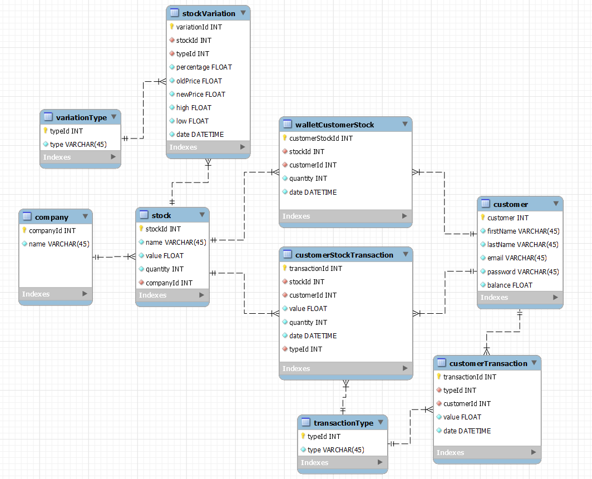
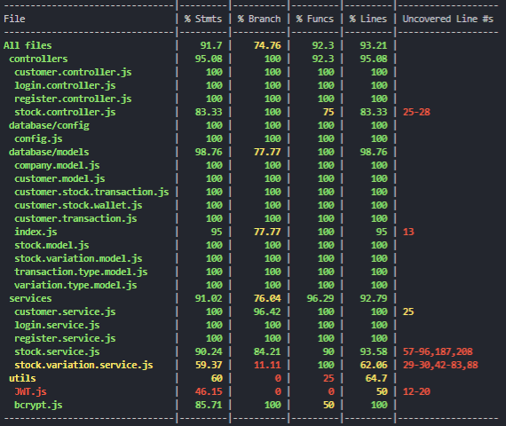
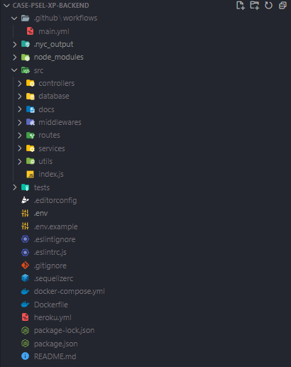
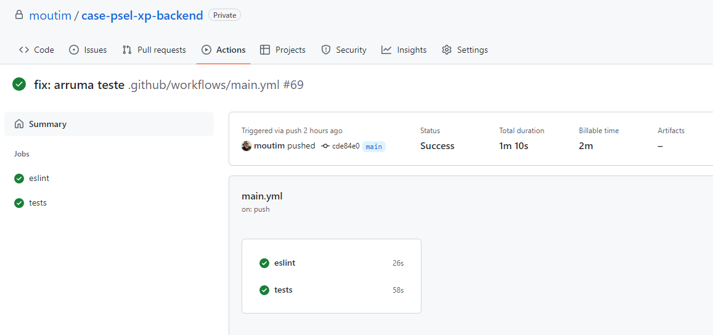
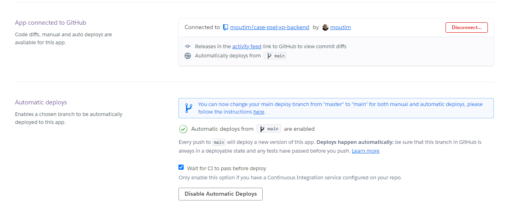
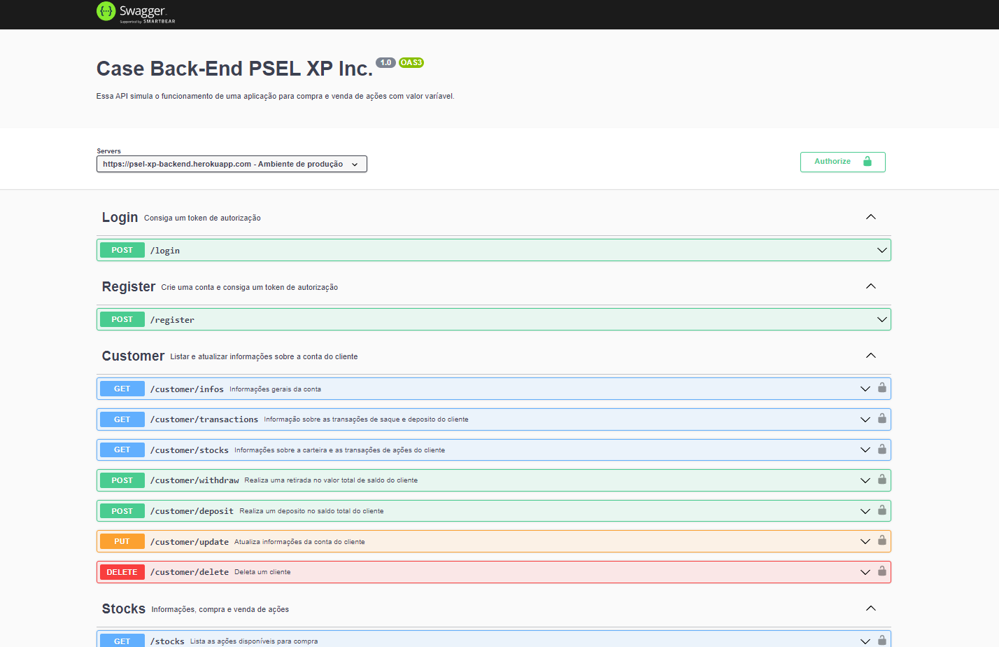

# Case Back-End PSEL XP Inc.

Essa aplicação simula um ambiente de uma corretora para investimentos em ações. Após ter realizada o cadastro ou o login, você receberá um token de autorização para realizar funcões com as ações e a conta do cliente.

  

## Resumo das funcionalidades da API

* Preço variável no valor de compra da ação. O valor pode subir ou descer até 4% a cada 5s;

* Criação de conta com úsuario e senha;

* Processo de login para geração de um token JWT de autenticação;

* Obter informações sobre a conta;

* Atualizar informações da conta;

* Realizar depósito no saldo total do cliente;

* Realizar saque a partir do saldo total do cliente;

* Deletar uma conta do DB;

* Obter a lista de transações de saque e depósito da conta;

* Obter a carteira de ações do cliente e todas as transações de compra e venda incluindo as ações;

* Listar informações sobre todas as ações disponíveis para compra, incluindo o valor total investido em cada uma e os dados sobre a variação de preço;

* Listar informações sobre uma ação a partir do ID da mesma;

* Comprar ações;

* Vender ações;

  

## Desenvolvimento

<strong>🧬 Padrões de desenvolvimento e boas práticas</strong>
 
  Nesse projeto, tentei seguir um padrão para o fluxo de desenvolvimento, que foi: 

  * Para toda nova implementação um PR era criado;
  * Desenvolver a implementação do requisito;
  * Escrever os testes unitários para o que foi desenvolvido;
  * Realizar o merge para a main ultilizando o CI/CD.
 
  Uso do ESLint com o `airbnb-base` para garantir um padrão de código.

  Uso do [Conventional Commits](https://www.conventionalcommits.org/en/v1.0.0/) para garantir commits mais semânticos e descritivos.
 

<strong>👨‍💻 Tecnologias e pacotes usados</strong>
 

* [JavaScript](https://www.javascript.com/)
* [Node.js](https://nodejs.org/en/)
* [Sequelize ORM](https://sequelize.org/)
* [MySQL](https://www.mysql.com/)
* [Mocha](https://mochajs.org/)
* [Chai](https://www.chaijs.com/)
* [Sinon](https://sinonjs.org/)
* [JWT](https://jwt.io/)
* [dotenv](https://www.npmjs.com/package/dotenv)
* [bcrypt](https://www.npmjs.com/package/bcrypt)
* [ExpressAsyncErrors](https://www.npmjs.com/package/express-async-errors)
* [ESLint](https://eslint.org/)
* [HTTP Status Codes](https://www.npmjs.com/package/http-status-codes)
* [Swagger UI Express](https://www.npmjs.com/package/swagger-ui-express)
* [Swagger JS Docs](https://www.npmjs.com/package/swagger-jsdoc)
 

<strong>📅 Banco de dados</strong>
 
  Para usar um banco de dados MySQL em ambiente de produção, escolhi usar um serviço em nuuvem, que foi a AWS RDS.

  A modelagem do banco de dados foi feita no WorkBench e normalizada até a 3ª Forma Normal.

  Os requisitos para as tabelas estarem na 3ª Forma Normal são:
  * Colunas devem possuir apenas um valor;
  * Valores em cada coluna devem ser do mesmo tipo de dados;
  * Cada coluna deve possuir um nome único;
  * A ordem dos dados registrados em uma tabela não deve afetar a integridade dos dados:
  * A tabela não deve possuir dependências parciais;
  * A tabela não deve conter atributos (colunas) que não sejam dependentes exclusivamente da  chave primária;

	
 

<strong>🧪 Testes unitários</strong>
 
  Para desenvolver os testes unitários, escolhi ultilizar Mocha, Chai e Sinon em conjunto.
  A cobertura total de testes em todos os arquivos da aplicação está em cerca de 90%;

  
 

<strong>🏗 Arquitetura de Software</strong>
 
  A arquitetura ultilizada nessa aplicação foi a MSC, que conta com as camadas de:

  * Model - responsável por executar as operações do banco de dados;
  * Service - responsável pela regra de negócio;
  * Controller - responsável pelo requisição e resposta.

  
 

<strong>📥 CI/CD</strong>
 
  O CI (Continuous integration / Integração contínua) foi implementado por meio do GitHub Actions para garantir que todas as novas funcionalidades não irão corromper a aplicação final. A cada novo merge para a main, é executado todos os testes unitários para confirmar que tudo está rodando conforme o esperado e o ESLint para garantir o padrão de código.

 

  O CD (Continuos delivery/ Entrega contínua) foi implementado pelo Heroku, para que todo novo merge na main, seja realizado o deploy automaticamente.

  
 

## Regras de negócio e endpoints

<strong>🙍‍♂️ Login </strong>
 
	O endpoint de login recebe pelo body da requisição o `email` e `password` e então é feito uma verificação no banco para saber se os dados estão iguais. Ao passar pela verificação, é gerado um token JWT de autorização para uso das funcionalidades da aplicação.

  * POST `/login`

 

<strong>🙍‍♀️ Registro </strong>
 
	O endpoint de registro recebe pelo body da requisição o `firstName`, `lastName`, `email` e `password` e então é realizado a inserção no banco. Cada novo úsuario recebe 500 em saldo na conta.

  * POST `/register`

 

<strong>📈 Ações </strong>
 
  As ações possuem o valor de compra variável, a cada 5s é executada uma função e de forma aleatória o preço da ação pode subir ou descer em até 4%.
  Ao todo, existem 4 endpoints para manipular as ações:

  * GET `/stocks`
    * Lista informações sobre todas as ações disponíveis para compra. Incluindo o total investido e os dados sobre a variação de preço
  * GET `/stocks/:id`
    * Lista as informações sobre uma ação pelo ID
  * POST `/stocks/buy`
    * Compre ações a partir das informações inseridas no body da requisição. É feita uma verificação se o cliente possui saldo suficiente em conta para realizar a compra.
  * POST `/stocks/sell`
    * Venda ações a partir das informações inseridas no body da requisição. É feita uma verificação para saber a quantidade total de ações disponíveis para compra.

 

<strong>🙍‍♀️🙍‍♂️ Clientes </strong>
 
  Ao todo existem 7 endpoints para listar e atualizar informações sobre a conta do cliente. 

  * GET `/customer/infos`
    * Lista as informações gerais sobre a conta do cliente
  * PUT `/customer/update`
    * Atualize as informações da conta do cliente a partir dos dados inseridos no body da requisição
  * POST `/customer/withdraw`
    * Realiza um saque no valor total de saldo do cliente. É feita uma verificação se o saldo é suficiente para realizar a retirada.
  * POST `/customer/deposit`
    * Realiza um depósito no valor total de saldo do cliente.
  * DELETE `/customer/delete`
    * O cliente é deletado
  * GET `/customer/transactions`
    * Lista todas as transações de saque e depósito do cliente
  * GET `customer/stocks`
    * Lista as ações que o cliente possui em carteira e todas as transações incluindo compra e venda de ações já realizadas pela conta.
 

## Documentação e deploy

O deploy da aplicação foi feita no Render (geralmente o servidor precisa ligar quando há uma requisição, então espere um pouco para que a página carregue) e o banco de dados usado foi o da AWS RDS com MySQL.

A documentação dessa API foi feita por meio do Swagger. 
[Documentação completa](https://case-psel-xp-backend.onrender.com/documentation/)

## Rodando aplicação via Docker ou Local
  ### Setando as variáveis de ambiente
  * Renomeie o arquivo `.env.example` para `.env` e insira as informações de acordo com o nome das variáveis. Se preferir, use as informações que já estão preenchidas, elas já estão configuradas para rodar localmente.

  ### Rodando com Docker
  Instale as dependências com `npm install`

  Rode o comando `docker-compose up -d` para subir os containers do coker
  * Garanta que as portas **3306** e **3000** não estão sendo usadas.

  Rode o comando `npm run db:restore`
  * Esse comando cria e popula o banco de dados a partir do Sequelize

  Execute o `npm run dev`
  * Verifique o log no seu console e veja a porta em que a aplicação está rodando

  ### Rodando localmente
  Requisitos:
  * Possuir Node.JS instalado;
  * Possuir MySQL instalado; 

  Instale as dependências com `npm install`

  Rode o comando `npm run db:restore`
  * Esse comando cria e popula o banco de dados a partir do Sequelize

  Execute o `npm run dev`
  * Verifique o log no seu console e veja a porta em que a aplicação está rodando
